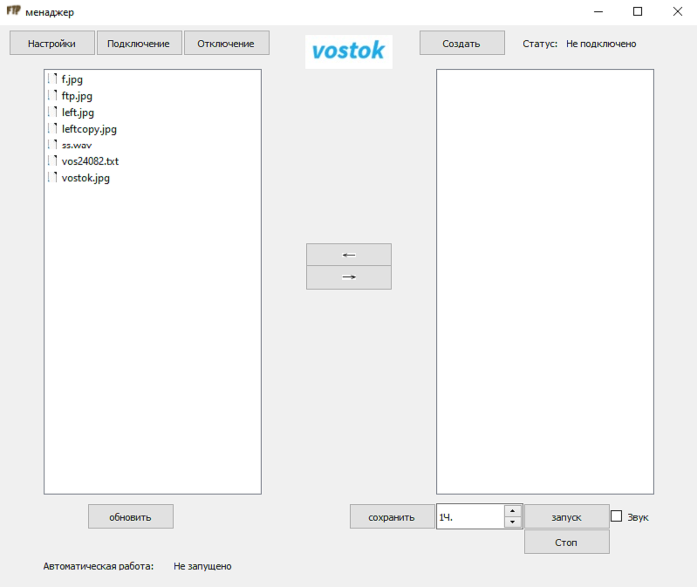
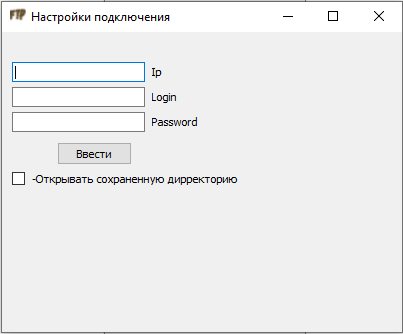
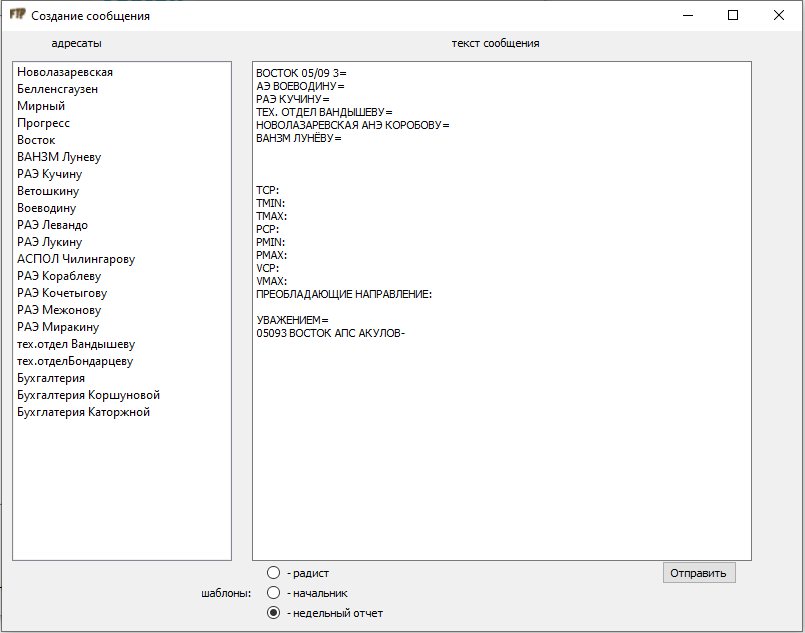

# FTPClient

## Содержание
- [Описание программы](#Описание-программы)
    - [Назначение](#Назначение)
    - [Пользователи](#Пользователи)
    - [Функции](#Функции)
    - [Дополнительные возможности](#Дополнительные-возможности)
- [Технические требования](#Технические-требования)
- [Функционал используемых модулей](#Функционал-используемых-модулей)
- [Инструкция](#Инструкция)
    - [Запуск и подключение](#Запуск-и-подключение)
    - [Обмен файлами с FTP-сервером ААНИИ](#Обмен-файлами-с-FTP-сервером-ААНИИ)
    - [Создание текстовых сообщений](#Создание-текстовых-сообщений)
    - [Редактирование адресатов](#Редактирование-адресатов)
    - [Редактирование шаблонов](#редактирование-шаблонов)
    - [Автоматическая работа](#Автоматическая-работа)
    - [Архивация](#архивация)
- [Требования безопасности](Требования-безопасности)

## Описание программы

### Назначение
Автоматизированная работа с FTP-сервером Арктического и Антарктического научно-исследовательского института.

### Пользователи
Начальники и радисты антарктических научно-исследовательских станций.

### Функции
- Обмен файлами
- Автоматическая загрузка файлов предназначенных для станции
- Ведение архива

### Дополнительные возможности

- Настраиваемый список адресатов
- Наличие настраиваемых шаблонов для сообщений


## Функциональность используемых модулей

| Модуль | Функционал |
| :--- | :--- |
| main\.py | главный файл программы,  координация работы всех модулей, настройки GUI, создание необходимых папок, работа в Tree |
| settingFTP\.py | методы для настройки и подключения к FTP |
| buttonFTP\.py | описание всех кнопок в главном окне |
| QlistVidgets\.py | описание и методы левого виджета списка |
| QlistVidgets2\.py | описание и методы правого виджета списка |
| windowsetting\.py | описание и методы модального окна *настройки подключения* |
| windowwload\.py | описание и методы модального окна *создание сообщения* |
| autojob\.py | методы для автоматической работы |
| FtpFunc\.py | отдельные функции программы |

## Инструкция
### Установка стороннего програмного обеспечения
Для работы с программой необходимы интерпретатор Python 3 и библиотека PyQt5.
1. Загрузите и установите интерпретатор Python 3 с [официального сайта](https://www.python.org/downloads/).
2. Установите библиотеку PyQt5. Для этого:
    1. Откройте командную строку (Windows) или терминал (macOS/Linux).
    2.  Введите команду:
        ```bash
        pip install PyQt5
        ```
    3.  Дождитесь окончания установки.
### Запуск и подключение.

1. Запустите файл **main\.py**, откроется главное окно программы:


2. Подключитесь. Для этого:
    1. Нажмите **Настройки**. Откроется модальное окно с настройками подключения:
    


    2. Заполните все поля.
    3. Нажмите **Ввести**.
    4. Закройте модальное окно.
    5. Нажмите **Подключение**. При успешном подключении в правом верхнем углу увидите **статус: подключено**.


***Примечание.*** *Если нет данных для подключения, запросите их в IT-отделе ААНИИ.*

***Важно!*** 
*При повторном подключении данные вводить не нужно.*

### Обмен файлами с FTP-сервером ААНИИ
#### Скачивание с сервера
 1. Откройте в правом виджете нужную папку (чаще всего это папка с названием вашей станции).
 2. Выберите нужный файл.
 3. Нажмите **←**. 
 4. Дождитесь окончания загрузки. Файл будет находиться в папке **files**.

 #### Загрузка на сервер

1. Загружаемый файл скопируйте в папку **files**. 
2. Под левым виджетом нажмите **обновить**.
3. Выберите ваш файл.
4. Нажмите **→**.

### Создание текстовых сообщений

1. Нажмите **Создать**. Откроется модальное окно *Создание сообщения*:

2. Выберите нужный шаблон. 
3. Дополните сообщение. 
4. Выберите адресата. 
5. Нажмите **Отправить**.  

***Важно!***
*Отправка не осуществится, если не введены настройки подключения.*

### Редактирование адресатов
При изменении лиц, учавствующих в сеансе связи, может потребоваться редактирование адресотов. Для этого:
1. В директории с программой откройте файл **adres/adres.txt**. 
2. Отступите две пустые строки от последней записи.
3. Введите имя адресата.
4. В следующей строке введите абсолютный путь до папки адресата в формате **rae/bell/akulov**. Пример записи: 
```
Акулов 
rae/bell/akulov 
```

### Редактирование шаблонов
При смене требований к оформлению может потребоваться смена шаблона. Чтобы изменить шаблон:
1. В директории с программой откройте папку **setting**.
2. Отредактируйте шаблоны: 
    - **sample1.txt** (радист)
    - **sample2.txt** (начальник)
    - **sample3.txt** (недельный отчет)

### Автоматическая работа
Для автоматической загрузки файлов, предназначенных для станции:
1. Подключитесь.
2. Откройте нужную директорию на сервере. 
3. Нажмите **Сохранить**. 
4. Установите нужный период подключения к серверу.
5. Нажмите **Запуск**. 
6. Отметьте поле **Звук**, если нужен сигнал после загрузки файлов.  

***Примечание.*** *Для автоматической работы не нужно держать подключение открытым: при срабатывании таймера программа сама подключится, поочередно загрузит все файлы и отключится.*

### Архивация
В папке **Arhive** содержатся папки **Download** и **Load**, при скачивании/загрузке файлов в них будут создаваться папки с датой в названии, где будут храниться копии файлов.


