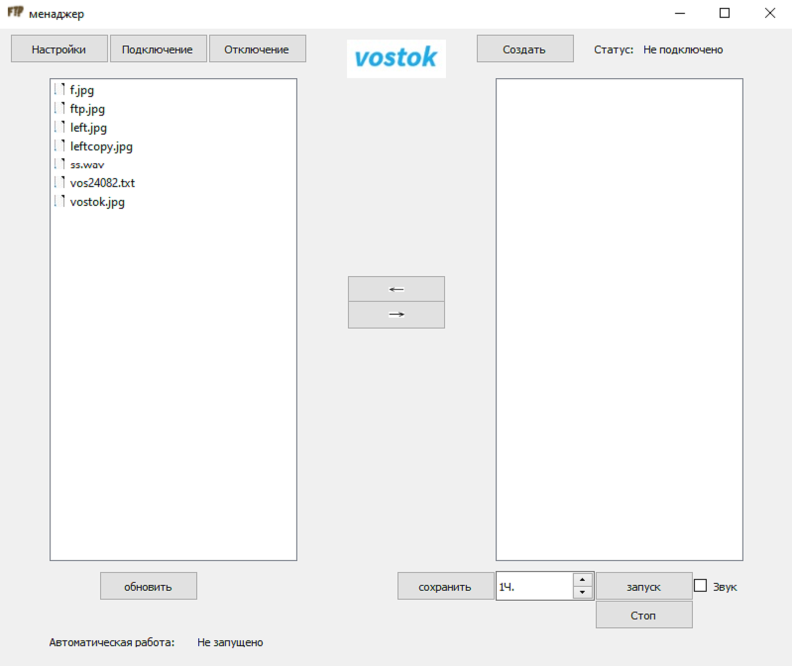
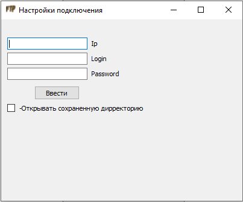

# FTPClient

## Содержание
- [Описание программы](#Описаниепрограммы)
- [Требования](#Требования)
- [Функционал используемых модулей](#Функционалиспользуемыхмодулей)
- [Инструкция](#Инструкция)

## Описание программы
### Назначение
Автоматизированная работа с FTP-сервером Арктического и Антарктического научно исследовательского института.

### Конечные пользователи
Начальники и радисты Антарктических научно-исследовательских станций.

### Функции
- Обмен файлами
- Автоматическая загрузка файлов предназначенных для станции
- Ведение архива

### Дополнительные возможности

- Настраиваемый список адрестов
- Наличие настраеваемых шаблонов для сообщений в текстовых файлах

## Требования
- ОС Windows
- Интерпритатор Python3
- Наличие библиотеки PyQt5

***Важно!***  
*Использование других ОС не гарантирует нормальной работы*

## Функционал используемых модулей

| Модуль | Функционал |
| :--- | :--- |
| main\.py | главный файл программы,  координация работы всех модулей, настройки GUI, создание днеобходимых папок, работа в Tree |
| settingFTP\.py | методы для настройки и подключения к FTP |
| buttonFTP\.py | описание всех кнопок в главном окне |
| QlistVidgets\.py | описание и методы левого виджета списка |
| QlistVidgets2\.py | описание и методы правого виджета списка |
| windowsetting\.py | описание и методы модального окна *настройки подключения* |
| windowwload\.py | описание и методы модального окна *создание сообщения* |
| autojob\.py | методы для автоматической работы |
| FtpFunc\.py | отдельные функции программы |

## Инструкция
### Запуск
Запустите файл **main\.py**, откроется главное окно программы:

### Настройки подключения
Нажмите **Настройки**, откроется модальное окно с настройками подключения:

Заполните все поля и нажмите **ввести**.
*Если нет данных, запросите в службе АСПД в ААНИИ*
Нажмите **Подключение**.
Если подключение прошло успешно, то в правом верхнем углу увидите **статус: подключено**, в правом виджете отобразится дирректория сервера.

