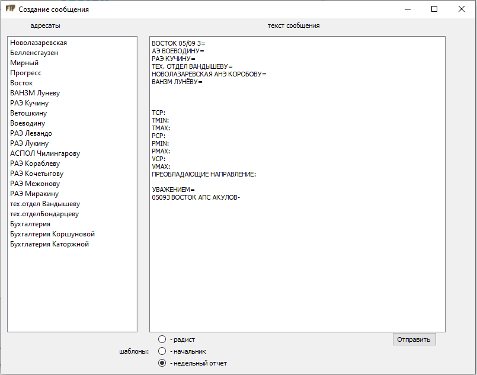

# FTPClient

## Содержание
- [Описание программы](#Описание-программы)
    - [Назначение](#Назначение)
    - [Конечные пользователи](#Конечные-пользователи)
    - [Функции](#Функции)
    - [Дополнительные возможности](#Дополнительные-возможности)
- [Технические требования](#Техническиетребования)
- [Функционал используемых модулей](#Функционал-используемых-модулей)
- [Инструкция](#Инструкция)
    - [Запуск](#Запуск)
    - [Подключение](#Подключение)
    - [Обмен файлами](#Обменфайлами)
    - [Создание текстовых сообщений](#Создание-текстовых-сообщений)
    - [Редактирование адресатов](#Редактирование-адресатов)
    - [Редактирование шаблонов](#редактирование-шаблонов)
    - [Автоматическая работа](#Автоматическая-работа)
    - [Архивация](#архивация)
- [Требования безопасности](Требования-безопасности)

## Описание программы
### Назначение
Автоматизированная работа с FTP-сервером Арктического и Антарктического научно исследовательского института.

### Конечные пользователи
Начальники и радисты Антарктических научно-исследовательских станций.

### Функции
- Обмен файлами
- Автоматическая загрузка файлов предназначенных для станции
- Ведение архива

### Дополнительные возможности

- Настраиваемый список адрестов
- Наличие настраеваемых шаблонов для сообщений в текстовых файлах

## Технические требования
- ОС Windows
- Интерпритатор Python3
- Наличие библиотеки PyQt5

***Важно!***  
*Использование других ОС не гарантирует нормальной работы*

## Функционал используемых модулей

| Модуль | Функционал |
| :--- | :--- |
| main\.py | главный файл программы,  координация работы всех модулей, настройки GUI, создание днеобходимых папок, работа в Tree |
| settingFTP\.py | методы для настройки и подключения к FTP |
| buttonFTP\.py | описание всех кнопок в главном окне |
| QlistVidgets\.py | описание и методы левого виджета списка |
| QlistVidgets2\.py | описание и методы правого виджета списка |
| windowsetting\.py | описание и методы модального окна *настройки подключения* |
| windowwload\.py | описание и методы модального окна *создание сообщения* |
| autojob\.py | методы для автоматической работы |
| FtpFunc\.py | отдельные функции программы |

## Инструкция
### Запуск
Запустите файл **main\.py**, откроется главное окно программы:

### Подключение
Нажмите **Настройки**, откроется модальное окно с настройками подключения:

Заполните все поля, нажмите **ввести**, закройте модальное окно, нажмите **Подключение**.

***Примечание!*** *Если нет данных, запросите в IT отделе ААНИИ.*

Если подключение прошло успешно, то в правом верхнем углу увидите **статус: подключено**, в правом виджете отобразится дирректория сервера.

При завершении работы нажмите **Отключение**.

***Важно!*** 
*Данные с настройками подключения сохраняются в файл **setting/settingftp.txt**, при повторном подключении достаточно нажать **Подключение***.

### Обмен файлами
Чтобы скачать файлы, откройте в правом виджете нужную папку (чаще всего это папка с названием вашей станции), выберите нужный файл и нажмите **←**. После загрузки увидите файл в списке в левом виджете. Файл будет находится в папке **files**.

Чтобы отправить файл на сервер в правом виджете откройте папку нужного адресата. Перенесите файл в папку **files** в дирректории с программой. Под левым виджетом нажмите **обновить** (должны увидеть свой файл), выберите файл и нажмите **→**.

### Создание текстовых сообщений

Нажмите **Создать**, откроется модальное окно *Создание сообщения*

Выбирите нужный шаблон, дополните сообщение, выберите адресата, нажмите **Отправить**.  
Текстовой файл уйдет в папку к нужному адресату.

***Важно!***
*Отправка осуществится только если сохранены настройки подключения.*

### Редактирование адресатов

В дерриктории с программой откройте файл **adres/adres.txt**. Отступите две пустые строки от последней записи. В первой строке введите имя адресата, в следующей абсолютный путь до папки адресата в формате **rae/bell/akulov**.

Пример записи:

***Акулов***  
**rae/bell/akulov**

### Редактирование шаблонов
В дирректории с программой откройте папку **setting**, отредайтируйте шаблоны **sample1.txt** (радист), **sample2.txt** (начальник), **sample3.txt** (недельный отчет) под ваши нужды.

### Автоматическая работа
Подключитесь, откройте нужную дирректорию на сервере, нажмите **Сохранить**. Установите нужный период подключения к серверу, нажмите **Запуск**. Отметте поле **Звук**, если нужен сигнал после загрузки файлов.  

***Примечание!*** *Для автоматической работы ненужно держать подключение открытым, при срабатывании таймера программа сама подключится, поочередно загрузит все файлы и отключится.*

### Архивация
В папке **Arhive** содержатся папки **Download** и **Load**, при скачивании/загрузке файлов в них будут создаваться папки с датой в названии, там будут копии файлов.

## Требования безопасности
- Программа предназначена для работы **ТОЛЬКО С РАБОЧЕГО КОМПЬЮТЕРА**. 
- Не допускайте попадания в чужие руки файла **setting.txt**. 

